# Claude Code Subagents Ecosystem - Visual Documentation

This comprehensive collection of Mermaid diagrams visualizes the Claude Code Subagents ecosystem, providing clear insights into the organization, relationships, and workflows of all 76 specialized agents.

## Table of Contents

1. [Agent Hierarchy Diagram](#1-agent-hierarchy-diagram)
2. [Agent Interaction Flow](#2-agent-interaction-flow)
3. [Model Selection Decision Tree](#3-model-selection-decision-tree)
4. [Agent Collaboration Network](#4-agent-collaboration-network)
5. [Task Complexity Mapping](#5-task-complexity-mapping)
6. [Development Lifecycle Diagram](#6-development-lifecycle-diagram)
7. [How to Use These Diagrams](#how-to-use-these-diagrams)
8. [Rendering Instructions](#rendering-instructions)

---

## 1. Agent Hierarchy Diagram

**Purpose**: Visualizes the complete organizational structure of all 76 Claude Code Subagents, categorized by domain and showing their assigned Claude models.

**Key Insights**:
- 15 agents use Haiku (fast & cost-effective)
- 44 agents use Sonnet (balanced performance) 
- 15 agents use Opus (maximum capability)
- Clear categorization into 9 major domains

**When to Use**: Understanding the overall ecosystem structure, finding the right agent category, or explaining the system architecture to stakeholders.

```mermaid
graph TD
    %% Root node
    Claude["🤖 Claude Code Subagents<br/>76 Total Agents"]
    
    %% Model Categories
    Claude --> Haiku["⚡ Haiku Model<br/>15 Agents<br/>Fast & Cost-Effective"]
    Claude --> Sonnet["⚖️ Sonnet Model<br/>44 Agents<br/>Balanced Performance"]
    Claude --> Opus["🧠 Opus Model<br/>15 Agents<br/>Maximum Capability"]
    
    %% Development & Architecture Category
    DevArch["🏗️ Development & Architecture"]
    Claude --> DevArch
    
    DevArch --> DA1["backend-architect<br/>(Sonnet)"]
    DevArch --> DA2["frontend-developer<br/>(Sonnet)"]
    DevArch --> DA3["ui-ux-designer<br/>(Sonnet)"]
    DevArch --> DA4["mobile-developer<br/>(Sonnet)"]
    DevArch --> DA5["graphql-architect<br/>(Sonnet)"]
    DevArch --> DA6["architect-reviewer<br/>(Opus)"]
    
    %% Language Specialists Category
    LangSpec["💻 Language Specialists"]
    Claude --> LangSpec
    
    LangSpec --> LS1["python-pro<br/>(Sonnet)"]
    LangSpec --> LS2["ruby-pro<br/>(Sonnet)"]
    LangSpec --> LS3["golang-pro<br/>(Sonnet)"]
    LangSpec --> LS4["rust-pro<br/>(Sonnet)"]
    LangSpec --> LS5["c-pro<br/>(Sonnet)"]
    LangSpec --> LS6["cpp-pro<br/>(Sonnet)"]
    LangSpec --> LS7["javascript-pro<br/>(Sonnet)"]
    LangSpec --> LS8["typescript-pro<br/>(Sonnet)"]
    LangSpec --> LS9["php-pro<br/>(Sonnet)"]
    LangSpec --> LS10["java-pro<br/>(Sonnet)"]
    LangSpec --> LS11["elixir-pro<br/>(Sonnet)"]
    LangSpec --> LS12["csharp-pro<br/>(Sonnet)"]
    LangSpec --> LS13["scala-pro<br/>(Sonnet)"]
    LangSpec --> LS14["flutter-expert<br/>(Sonnet)"]
    LangSpec --> LS15["unity-developer<br/>(Sonnet)"]
    LangSpec --> LS16["minecraft-bukkit-pro<br/>(Sonnet)"]
    LangSpec --> LS17["ios-developer<br/>(Sonnet)"]
    LangSpec --> LS18["sql-pro<br/>(Sonnet)"]
    
    %% Infrastructure & Operations Category
    InfraOps["⚙️ Infrastructure & Operations"]
    Claude --> InfraOps
    
    InfraOps --> IO1["devops-troubleshooter<br/>(Sonnet)"]
    InfraOps --> IO2["deployment-engineer<br/>(Sonnet)"]
    InfraOps --> IO3["cloud-architect<br/>(Opus)"]
    InfraOps --> IO4["hybrid-cloud-architect<br/>(Sonnet)"]
    InfraOps --> IO5["kubernetes-architect<br/>(Sonnet)"]
    InfraOps --> IO6["database-optimizer<br/>(Sonnet)"]
    InfraOps --> IO7["database-admin<br/>(Sonnet)"]
    InfraOps --> IO8["terraform-specialist<br/>(Sonnet)"]
    InfraOps --> IO9["incident-responder<br/>(Opus)"]
    InfraOps --> IO10["network-engineer<br/>(Sonnet)"]
    InfraOps --> IO11["dx-optimizer<br/>(Sonnet)"]
    
    %% Quality & Security Category
    QualSec["🔒 Quality & Security"]
    Claude --> QualSec
    
    QualSec --> QS1["code-reviewer<br/>(Sonnet)"]
    QualSec --> QS2["security-auditor<br/>(Opus)"]
    QualSec --> QS3["test-automator<br/>(Sonnet)"]
    QualSec --> QS4["performance-engineer<br/>(Opus)"]
    QualSec --> QS5["debugger<br/>(Sonnet)"]
    QualSec --> QS6["error-detective<br/>(Sonnet)"]
    QualSec --> QS7["search-specialist<br/>(Haiku)"]
    
    %% Data & AI Category
    DataAI["🤖 Data & AI"]
    Claude --> DataAI
    
    DataAI --> DAI1["data-scientist<br/>(Haiku)"]
    DataAI --> DAI2["data-engineer<br/>(Sonnet)"]
    DataAI --> DAI3["ai-engineer<br/>(Opus)"]
    DataAI --> DAI4["ml-engineer<br/>(Sonnet)"]
    DataAI --> DAI5["mlops-engineer<br/>(Opus)"]
    DataAI --> DAI6["prompt-engineer<br/>(Opus)"]
    
    %% Specialized Domains Category
    SpecDom["🎯 Specialized Domains"]
    Claude --> SpecDom
    
    SpecDom --> SD1["api-documenter<br/>(Haiku)"]
    SpecDom --> SD2["payment-integration<br/>(Sonnet)"]
    SpecDom --> SD3["quant-analyst<br/>(Opus)"]
    SpecDom --> SD4["risk-manager<br/>(Opus)"]
    SpecDom --> SD5["legacy-modernizer<br/>(Sonnet)"]
    SpecDom --> SD6["context-manager<br/>(Opus)"]
    
    %% Documentation Category
    Docs["📚 Documentation"]
    Claude --> Docs
    
    Docs --> D1["docs-architect<br/>(Opus)"]
    Docs --> D2["mermaid-expert<br/>(Sonnet)"]
    Docs --> D3["reference-builder<br/>(Haiku)"]
    Docs --> D4["tutorial-engineer<br/>(Opus)"]
    
    %% Business & Marketing Category
    BizMark["💼 Business & Marketing"]
    Claude --> BizMark
    
    BizMark --> BM1["business-analyst<br/>(Haiku)"]
    BizMark --> BM2["content-marketer<br/>(Haiku)"]
    BizMark --> BM3["hp-pro<br/>(Sonnet)"]
    BizMark --> BM4["sales-automator<br/>(Haiku)"]
    BizMark --> BM5["customer-support<br/>(Haiku)"]
    BizMark --> BM6["legal-advisor<br/>(Haiku)"]
    
    %% SEO & Content Optimization Category
    SEO["🎯 SEO & Content Optimization"]
    Claude --> SEO
    
    SEO --> S1["seo-content-auditor<br/>(Sonnet)"]
    SEO --> S2["seo-meta-optimizer<br/>(Haiku)"]
    SEO --> S3["seo-keyword-strategist<br/>(Haiku)"]
    SEO --> S4["seo-structure-architect<br/>(Haiku)"]
    SEO --> S5["seo-snippet-hunter<br/>(Haiku)"]
    SEO --> S6["seo-content-refresher<br/>(Haiku)"]
    SEO --> S7["seo-cannibalization-detector<br/>(Haiku)"]
    SEO --> S8["seo-authority-builder<br/>(Sonnet)"]
    SEO --> S9["seo-content-writer<br/>(Sonnet)"]
    SEO --> S10["seo-content-planner<br/>(Haiku)"]
    
    %% Styling
    classDef haikuAgent fill:#e1f5fe,stroke:#0277bd,stroke-width:2px
    classDef sonnetAgent fill:#f3e5f5,stroke:#7b1fa2,stroke-width:2px
    classDef opusAgent fill:#fff3e0,stroke:#f57c00,stroke-width:2px
    classDef category fill:#f5f5f5,stroke:#424242,stroke-width:2px
    classDef model fill:#e8f5e8,stroke:#2e7d32,stroke-width:3px
    
    class Claude category
    class Haiku,Sonnet,Opus model
    class DevArch,LangSpec,InfraOps,QualSec,DataAI,SpecDom,Docs,BizMark,SEO category
```

---

## 2. Agent Interaction Flow

**Purpose**: Demonstrates how agents collaborate in common real-world workflows across development, incident response, AI/ML, content creation, and cloud migration.

**Key Insights**:
- Shows practical agent collaboration patterns
- Illustrates workflow-specific agent sequences
- Demonstrates cross-domain coordination
- Highlights the role of context-manager as coordinator

**When to Use**: Planning complex projects, understanding workflow dependencies, or training teams on agent collaboration patterns.

```mermaid
graph TD
    %% Development Pipeline Workflow
    subgraph DevPipeline ["🔄 Development Pipeline Workflow"]
        direction TB
        
        Requirements["📋 Requirements<br/>Analysis"]
        Requirements --> BackendArch["backend-architect<br/>(Sonnet)"]
        Requirements --> FrontendDev["frontend-developer<br/>(Sonnet)"]
        Requirements --> UIUX["ui-ux-designer<br/>(Sonnet)"]
        
        BackendArch --> PythonPro["python-pro<br/>(Sonnet)"]
        BackendArch --> JavaPro["java-pro<br/>(Sonnet)"]
        BackendArch --> SQLPro["sql-pro<br/>(Sonnet)"]
        
        FrontendDev --> JSPro["javascript-pro<br/>(Sonnet)"]
        FrontendDev --> TSPro["typescript-pro<br/>(Sonnet)"]
        
        PythonPro --> CodeReviewer["code-reviewer<br/>(Sonnet)"]
        JavaPro --> CodeReviewer
        JSPro --> CodeReviewer
        TSPro --> CodeReviewer
        
        CodeReviewer --> TestAuto["test-automator<br/>(Sonnet)"]
        TestAuto --> DeployEng["deployment-engineer<br/>(Sonnet)"]
        
        DeployEng --> ArchReviewer["architect-reviewer<br/>(Opus)"]
    end
    
    %% Incident Response Workflow
    subgraph IncidentFlow ["🚨 Incident Response Workflow"]
        direction TB
        
        Alert["🔔 Production Alert"]
        Alert --> IncidentResp["incident-responder<br/>(Opus)"]
        
        IncidentResp --> DevOpsTrouble["devops-troubleshooter<br/>(Sonnet)"]
        IncidentResp --> ErrorDetective["error-detective<br/>(Sonnet)"]
        IncidentResp --> PerfEng["performance-engineer<br/>(Opus)"]
        
        DevOpsTrouble --> NetEng["network-engineer<br/>(Sonnet)"]
        ErrorDetective --> Debugger["debugger<br/>(Sonnet)"]
        PerfEng --> DBOptim["database-optimizer<br/>(Sonnet)"]
        
        NetEng --> Resolution["✅ Resolution"]
        Debugger --> Resolution
        DBOptim --> Resolution
        
        Resolution --> DocsArch["docs-architect<br/>(Opus)"]
    end
    
    %% AI/ML Development Workflow
    subgraph MLFlow ["🤖 AI/ML Development Workflow"]
        direction TB
        
        DataReq["📊 Data Requirements"]
        DataReq --> DataSci["data-scientist<br/>(Haiku)"]
        DataSci --> DataEng["data-engineer<br/>(Sonnet)"]
        
        DataEng --> MLEng["ml-engineer<br/>(Sonnet)"]
        MLEng --> AIEng["ai-engineer<br/>(Opus)"]
        
        AIEng --> PromptEng["prompt-engineer<br/>(Opus)"]
        PromptEng --> MLOpsEng["mlops-engineer<br/>(Opus)"]
        
        MLOpsEng --> SecurityAud["security-auditor<br/>(Opus)"]
        SecurityAud --> PerfEngML["performance-engineer<br/>(Opus)"]
    end
    
    %% Content & SEO Workflow
    subgraph SEOFlow ["📝 Content & SEO Workflow"]
        direction TB
        
        ContentReq["📄 Content Requirements"]
        ContentReq --> ContentMark["content-marketer<br/>(Haiku)"]
        ContentMark --> SEOContentWriter["seo-content-writer<br/>(Sonnet)"]
        
        SEOContentWriter --> SEOKeyword["seo-keyword-strategist<br/>(Haiku)"]
        SEOKeyword --> SEOStruct["seo-structure-architect<br/>(Haiku)"]
        
        SEOStruct --> SEOMeta["seo-meta-optimizer<br/>(Haiku)"]
        SEOMeta --> SEOAuditor["seo-content-auditor<br/>(Sonnet)"]
        
        SEOAuditor --> SEOAuth["seo-authority-builder<br/>(Sonnet)"]
        SEOAuth --> SEOSnippet["seo-snippet-hunter<br/>(Haiku)"]
    end
    
    %% Cloud Migration Workflow
    subgraph CloudFlow ["☁️ Cloud Migration Workflow"]
        direction TB
        
        Migration["🔄 Migration Request"]
        Migration --> CloudArch["cloud-architect<br/>(Opus)"]
        CloudArch --> TerraformSpec["terraform-specialist<br/>(Sonnet)"]
        
        TerraformSpec --> K8sArch["kubernetes-architect<br/>(Sonnet)"]
        K8sArch --> DevOpsEng["deployment-engineer<br/>(Sonnet)"]
        
        DevOpsEng --> SecurityAudCloud["security-auditor<br/>(Opus)"]
        SecurityAudCloud --> PerfEngCloud["performance-engineer<br/>(Opus)"]
        
        PerfEngCloud --> DXOpt["dx-optimizer<br/>(Sonnet)"]
        DXOpt --> LegacyMod["legacy-modernizer<br/>(Sonnet)"]
    end
    
    %% Cross-workflow connections
    ArchReviewer -.-> IncidentResp
    DocsArch -.-> TutorialEng["tutorial-engineer<br/>(Opus)"]
    ContextMgr["context-manager<br/>(Opus)"] -.-> ArchReviewer
    ContextMgr -.-> IncidentResp
    ContextMgr -.-> CloudArch
    
    %% Styling
    classDef haikuAgent fill:#e1f5fe,stroke:#0277bd,stroke-width:2px
    classDef sonnetAgent fill:#f3e5f5,stroke:#7b1fa2,stroke-width:2px
    classDef opusAgent fill:#fff3e0,stroke:#f57c00,stroke-width:2px
    classDef workflow fill:#f0f4c3,stroke:#827717,stroke-width:2px
    classDef trigger fill:#ffebee,stroke:#d32f2f,stroke-width:2px
    classDef outcome fill:#e8f5e8,stroke:#2e7d32,stroke-width:2px
    
    class Requirements,DataReq,ContentReq,Migration trigger
    class Resolution,DocsArch,TutorialEng,LegacyMod outcome
    class DevPipeline,IncidentFlow,MLFlow,SEOFlow,CloudFlow workflow
```

---

## 3. Model Selection Decision Tree

**Purpose**: Provides a clear decision framework for choosing the appropriate Claude model (Haiku, Sonnet, Opus) based on task characteristics and requirements.

**Key Insights**:
- Task complexity is the primary factor
- Cost, time, and accuracy trade-offs
- Clear escalation paths between models
- Specific use case examples for each model

**When to Use**: Optimizing costs and performance, training users on model selection, or making strategic decisions about agent deployment.

```mermaid
graph TD
    Start["🤔 Task Request"] --> Complexity{"What's the task<br/>complexity?"}
    
    %% Simple Tasks Branch
    Complexity -->|Simple| Simple["🟢 Simple Task<br/>• Data queries<br/>• Documentation<br/>• Basic analysis<br/>• Content creation<br/>• Standard operations"]
    
    Simple --> HaikuCriteria{"Does it require<br/>specialized knowledge<br/>or complex reasoning?"}
    HaikuCriteria -->|No| HaikuModel["⚡ HAIKU<br/>Fast & Cost-Effective<br/>15 Agents"]
    HaikuCriteria -->|Yes| SonnetModel["⚖️ SONNET<br/>Balanced Performance<br/>44 Agents"]
    
    %% Moderate Tasks Branch
    Complexity -->|Moderate| Moderate["🟡 Moderate Task<br/>• Code development<br/>• System design<br/>• Infrastructure setup<br/>• Testing & debugging<br/>• Integration work"]
    
    Moderate --> ModerateCheck{"Is this mission-critical<br/>or requires deep<br/>architectural insight?"}
    ModerateCheck -->|No| SonnetModel
    ModerateCheck -->|Yes| OpusModel["🧠 OPUS<br/>Maximum Capability<br/>15 Agents"]
    
    %% Complex Tasks Branch
    Complexity -->|Complex| Complex["🔴 Complex Task<br/>• AI/ML systems<br/>• Security auditing<br/>• Performance optimization<br/>• Incident response<br/>• Financial modeling<br/>• Architectural review"]
    
    Complex --> OpusModel
    
    %% Model Details
    HaikuModel --> HaikuAgents["Haiku Agents:<br/>• data-scientist<br/>• api-documenter<br/>• reference-builder<br/>• business-analyst<br/>• content-marketer<br/>• sales-automator<br/>• customer-support<br/>• search-specialist<br/>• legal-advisor<br/>• SEO specialists (7)"]
    
    SonnetModel --> SonnetAgents["Sonnet Agents:<br/>• All language specialists (18)<br/>• Development & architecture (5)<br/>• Infrastructure & ops (9)<br/>• Quality & testing (5)<br/>• Specialized domains (3)<br/>• Documentation (1)<br/>• Business (1)<br/>• SEO content (2)"]
    
    OpusModel --> OpusAgents["Opus Agents:<br/>• ai-engineer<br/>• security-auditor<br/>• performance-engineer<br/>• incident-responder<br/>• mlops-engineer<br/>• architect-reviewer<br/>• cloud-architect<br/>• prompt-engineer<br/>• context-manager<br/>• quant-analyst<br/>• risk-manager<br/>• docs-architect<br/>• tutorial-engineer"]
    
    %% Decision Factors
    subgraph DecisionFactors ["🎯 Key Decision Factors"]
        Factor1["💰 Cost Sensitivity<br/>Haiku = Lowest<br/>Sonnet = Medium<br/>Opus = Highest"]
        Factor2["⏰ Time Constraints<br/>Haiku = Fastest<br/>Sonnet = Balanced<br/>Opus = Thorough"]
        Factor3["🎯 Accuracy Requirements<br/>Haiku = Good<br/>Sonnet = High<br/>Opus = Maximum"]
        Factor4["🔧 Task Complexity<br/>Haiku = Simple<br/>Sonnet = Moderate<br/>Opus = Complex"]
        Factor5["⚠️ Risk Level<br/>Haiku = Low Risk<br/>Sonnet = Medium Risk<br/>Opus = High Risk"]
    end
    
    %% Use Case Examples
    subgraph UseCases ["📋 Common Use Cases by Model"]
        direction TB
        
        HaikuUses["⚡ Haiku Use Cases:<br/>• SQL data queries<br/>• API documentation<br/>• Content writing<br/>• SEO optimization<br/>• Customer support<br/>• Business metrics<br/>• Quick research"]
        
        SonnetUses["⚖️ Sonnet Use Cases:<br/>• Application development<br/>• Code reviews<br/>• System design<br/>• Infrastructure setup<br/>• Testing automation<br/>• Database optimization<br/>• DevOps tasks"]
        
        OpusUses["🧠 Opus Use Cases:<br/>• AI/ML development<br/>• Security audits<br/>• Performance tuning<br/>• Crisis response<br/>• Financial modeling<br/>• Architecture decisions<br/>• Complex integrations"]
    end
    
    %% Escalation Path
    HaikuModel -.->|"If task proves<br/>more complex"| SonnetModel
    SonnetModel -.->|"If requires<br/>expert insight"| OpusModel
    
    %% Styling
    classDef haiku fill:#e1f5fe,stroke:#0277bd,stroke-width:3px
    classDef sonnet fill:#f3e5f5,stroke:#7b1fa2,stroke-width:3px
    classDef opus fill:#fff3e0,stroke:#f57c00,stroke-width:3px
    classDef decision fill:#f0f4c3,stroke:#827717,stroke-width:2px
    classDef task fill:#e8eaf6,stroke:#3f51b5,stroke-width:2px
    classDef factor fill:#fce4ec,stroke:#e91e63,stroke-width:2px
    classDef usecase fill:#e0f2f1,stroke:#00695c,stroke-width:2px
    
    class HaikuModel,HaikuAgents,HaikuUses haiku
    class SonnetModel,SonnetAgents,SonnetUses sonnet
    class OpusModel,OpusAgents,OpusUses opus
    class Complexity,HaikuCriteria,ModerateCheck decision
    class Start,Simple,Moderate,Complex task
    class Factor1,Factor2,Factor3,Factor4,Factor5 factor
    class DecisionFactors,UseCases usecase
```

---

## 4. Agent Collaboration Network

**Purpose**: Maps the relationships and collaboration patterns between different agents, showing how they work together in practice.

**Key Insights**:
- Central coordination roles (context-manager, architect-reviewer)
- Clustered agent groups by domain
- Strong collaboration patterns within and across clusters
- Critical integration points between different specializations

**When to Use**: Understanding agent dependencies, planning team compositions, or optimizing collaboration workflows.

```mermaid
graph TD
    %% Central coordination agents
    ContextMgr["🎯 context-manager<br/>(Opus)"]
    ArchReviewer["🏗️ architect-reviewer<br/>(Opus)"]
    
    %% Development Cluster
    subgraph DevCluster ["💻 Development Cluster"]
        BackendArch["backend-architect<br/>(Sonnet)"]
        FrontendDev["frontend-developer<br/>(Sonnet)"]
        UIUX["ui-ux-designer<br/>(Sonnet)"]
        MobileDev["mobile-developer<br/>(Sonnet)"]
        GraphQLArch["graphql-architect<br/>(Sonnet)"]
    end
    
    %% Language Specialists Cluster
    subgraph LangCluster ["🔤 Language Specialists"]
        PythonPro["python-pro<br/>(Sonnet)"]
        JavaPro["java-pro<br/>(Sonnet)"]
        JSPro["javascript-pro<br/>(Sonnet)"]
        TSPro["typescript-pro<br/>(Sonnet)"]
        GoPro["golang-pro<br/>(Sonnet)"]
        RustPro["rust-pro<br/>(Sonnet)"]
    end
    
    %% Quality Assurance Cluster
    subgraph QACluster ["🔍 Quality Assurance"]
        CodeReviewer["code-reviewer<br/>(Sonnet)"]
        TestAuto["test-automator<br/>(Sonnet)"]
        SecurityAud["security-auditor<br/>(Opus)"]
        PerfEng["performance-engineer<br/>(Opus)"]
        Debugger["debugger<br/>(Sonnet)"]
        ErrorDetective["error-detective<br/>(Sonnet)"]
    end
    
    %% Infrastructure Cluster
    subgraph InfraCluster ["⚙️ Infrastructure"]
        DevOpsTrouble["devops-troubleshooter<br/>(Sonnet)"]
        DeployEng["deployment-engineer<br/>(Sonnet)"]
        CloudArch["cloud-architect<br/>(Opus)"]
        K8sArch["kubernetes-architect<br/>(Sonnet)"]
        TerraformSpec["terraform-specialist<br/>(Sonnet)"]
        NetEng["network-engineer<br/>(Sonnet)"]
    end
    
    %% Data & AI Cluster
    subgraph DataAICluster ["🤖 Data & AI"]
        DataSci["data-scientist<br/>(Haiku)"]
        DataEng["data-engineer<br/>(Sonnet)"]
        MLEng["ml-engineer<br/>(Sonnet)"]
        AIEng["ai-engineer<br/>(Opus)"]
        MLOpsEng["mlops-engineer<br/>(Opus)"]
        PromptEng["prompt-engineer<br/>(Opus)"]
    end
    
    %% Documentation Cluster
    subgraph DocsCluster ["📚 Documentation"]
        DocsArch["docs-architect<br/>(Opus)"]
        MermaidExp["mermaid-expert<br/>(Sonnet)"]
        RefBuilder["reference-builder<br/>(Haiku)"]
        TutorialEng["tutorial-engineer<br/>(Opus)"]
        APIDoc["api-documenter<br/>(Haiku)"]
    end
    
    %% Business & Content Cluster
    subgraph BizCluster ["💼 Business & Content"]
        BizAnalyst["business-analyst<br/>(Haiku)"]
        ContentMark["content-marketer<br/>(Haiku)"]
        SEOWriter["seo-content-writer<br/>(Sonnet)"]
        SEOAuditor["seo-content-auditor<br/>(Sonnet)"]
        SearchSpec["search-specialist<br/>(Haiku)"]
    end
    
    %% Emergency Response Cluster
    subgraph EmergencyCluster ["🚨 Emergency Response"]
        IncidentResp["incident-responder<br/>(Opus)"]
        DBOptim["database-optimizer<br/>(Sonnet)"]
        DBAAdmin["database-admin<br/>(Sonnet)"]
    end
    
    %% Core Relationships - Context Manager coordinates everything
    ContextMgr --> ArchReviewer
    ContextMgr --> IncidentResp
    ContextMgr --> CloudArch
    ContextMgr --> AIEng
    ContextMgr --> SecurityAud
    
    %% Development Flow Relationships
    ArchReviewer --> BackendArch
    ArchReviewer --> FrontendDev
    BackendArch --> PythonPro
    BackendArch --> JavaPro
    FrontendDev --> JSPro
    FrontendDev --> TSPro
    UIUX --> FrontendDev
    MobileDev --> FrontendDev
    GraphQLArch --> BackendArch
    
    %% Quality Assurance Relationships
    PythonPro --> CodeReviewer
    JavaPro --> CodeReviewer
    JSPro --> CodeReviewer
    TSPro --> CodeReviewer
    CodeReviewer --> TestAuto
    CodeReviewer --> SecurityAud
    TestAuto --> PerfEng
    SecurityAud --> PerfEng
    Debugger --> ErrorDetective
    
    %% Infrastructure Relationships
    DeployEng --> DevOpsTrouble
    DeployEng --> CloudArch
    CloudArch --> K8sArch
    CloudArch --> TerraformSpec
    K8sArch --> NetEng
    DevOpsTrouble --> NetEng
    IncidentResp --> DevOpsTrouble
    IncidentResp --> NetEng
    
    %% Data & AI Relationships
    DataSci --> DataEng
    DataEng --> MLEng
    MLEng --> AIEng
    AIEng --> PromptEng
    MLEng --> MLOpsEng
    MLOpsEng --> DeployEng
    
    %% Documentation Relationships
    ArchReviewer --> DocsArch
    DocsArch --> TutorialEng
    DocsArch --> MermaidExp
    APIDoc --> RefBuilder
    BackendArch --> APIDoc
    
    %% Business & SEO Relationships
    ContentMark --> SEOWriter
    SEOWriter --> SEOAuditor
    SearchSpec --> BizAnalyst
    BizAnalyst --> ContentMark
    
    %% Emergency Response Relationships
    IncidentResp --> DBOptim
    IncidentResp --> DBAAdmin
    PerfEng --> DBOptim
    DBOptim --> DBAAdmin
    
    %% Cross-cluster collaborations (dotted lines)
    SecurityAud -.-> CloudArch
    SecurityAud -.-> AIEng
    PerfEng -.-> CloudArch
    PerfEng -.-> MLOpsEng
    DocsArch -.-> SecurityAud
    TutorialEng -.-> TestAuto
    
    %% Styling
    classDef haiku fill:#e1f5fe,stroke:#0277bd,stroke-width:2px
    classDef sonnet fill:#f3e5f5,stroke:#7b1fa2,stroke-width:2px
    classDef opus fill:#fff3e0,stroke:#f57c00,stroke-width:2px
    classDef cluster fill:#f8f9fa,stroke:#6c757d,stroke-width:1px
    classDef central fill:#fff8e1,stroke:#ff8f00,stroke-width:4px
    
    %% Apply central coordination styling
    class ContextMgr,ArchReviewer central
    
    %% Apply cluster styling  
    class DevCluster,LangCluster,QACluster,InfraCluster,DataAICluster,DocsCluster,BizCluster,EmergencyCluster cluster
```

---

## 5. Task Complexity Mapping

**Purpose**: Visualizes the relationship between task complexity and specialization level for all 76 agents, helping with optimal agent selection.

**Key Insights**:
- Clear separation between Haiku (low complexity), Sonnet (medium), and Opus (high complexity) agents
- Specialization level varies within each model category
- Strategic positioning of agents based on their optimal use cases

**When to Use**: Strategic planning for agent deployment, cost optimization, or understanding the capability spectrum.

---

## 6. Development Lifecycle Diagram

**Purpose**: Maps all agents to their primary roles in the Software Development Lifecycle (SDLC), showing how they contribute to each phase.

**Key Insights**:
- Comprehensive coverage across all SDLC phases
- Clear phase ownership and collaboration patterns  
- Continuous processes that span multiple phases
- Feedback loops and iterative workflows

**When to Use**: Project planning, resource allocation, understanding agent responsibilities throughout development cycles.

---

## How to Use These Diagrams

### For Project Managers
- **Agent Hierarchy**: Understand available resources and capabilities
- **Interaction Flow**: Plan complex project workflows 
- **Model Selection**: Optimize costs while meeting quality requirements
- **Development Lifecycle**: Map agents to project phases

### For Technical Leaders
- **Collaboration Network**: Identify key coordination points and dependencies
- **Task Complexity**: Match agent capabilities to technical requirements
- **Agent Interaction**: Design efficient workflows for common scenarios

### For Developers
- **Model Selection**: Choose appropriate agents for specific tasks
- **Development Lifecycle**: Understand which agents support each development phase
- **Collaboration Network**: Find the right experts for collaboration

### For Business Stakeholders  
- **Agent Hierarchy**: Understand the scope and organization of capabilities
- **Task Complexity**: Grasp the relationship between complexity and cost
- **Model Selection**: Make informed decisions about resource allocation

---

## Rendering Instructions

### For Mermaid Renderers
1. **Online**: Copy diagram code to [mermaid.live](https://mermaid.live) for instant rendering
2. **VS Code**: Use the Mermaid Preview extension
3. **GitHub**: These diagrams render natively in GitHub markdown
4. **Documentation Tools**: Most modern documentation platforms support Mermaid

### Styling Notes
- **Haiku agents**: Light blue background (`#e1f5fe`)
- **Sonnet agents**: Light purple background (`#f3e5f5`) 
- **Opus agents**: Light orange background (`#fff3e0`)
- **Workflows/Phases**: Light yellow background (`#f0f4c3`)
- **Decision points**: Light gray background (`#f5f5f5`)

### Accessibility
- All diagrams use high contrast colors for readability
- Text labels are descriptive and include model information
- Logical flow patterns from left to right or top to bottom
- Clear visual hierarchy with appropriate font sizes

### Export Options
- **PNG/SVG**: For presentations and static documentation
- **PDF**: For formal documentation and reports
- **Interactive HTML**: For web-based documentation with zoom/pan capabilities

---

## Files Created

1. `/var/www/public_html/diagrams/01-agent-hierarchy.mmd` - Complete agent organization
2. `/var/www/public_html/diagrams/02-agent-interaction-flow.mmd` - Workflow patterns
3. `/var/www/public_html/diagrams/03-model-selection-tree.mmd` - Decision framework
4. `/var/www/public_html/diagrams/04-agent-collaboration-network.mmd` - Relationship mapping
5. `/var/www/public_html/diagrams/05-task-complexity-mapping.mmd` - Complexity visualization
6. `/var/www/public_html/diagrams/06-development-lifecycle.mmd` - SDLC agent mapping
7. `/var/www/public_html/diagrams/DIAGRAMS_INDEX.md` - This comprehensive guide

These diagrams provide a complete visual documentation system for the Claude Code Subagents ecosystem, enabling better understanding, planning, and utilization of the 76 specialized agents across their three Claude models.